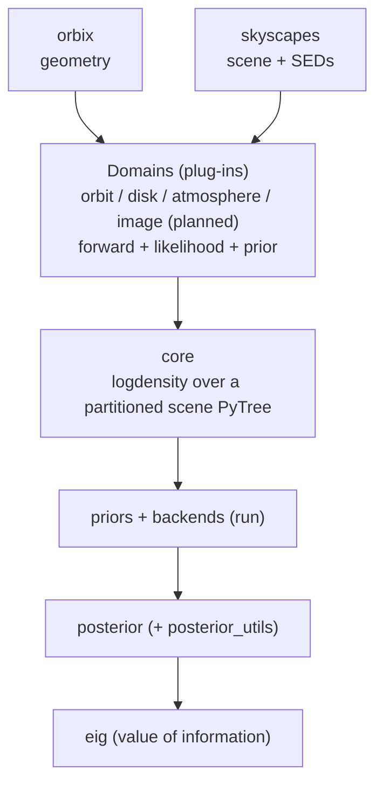

# Architecture

photomancy is a JAX-native engine for Bayesian inference and value of information
over astrophysical scenes observed by direct imaging. orbix builds the geometry and
skyscapes builds the scene, and photomancy divines the scene back from the data:
posteriors over the scene parameters, the Bayesian evidence for model comparison,
and the expected information gain of a candidate next observation. The engine is
forward-model agnostic, so the same inference machinery serves orbit fitting today
and disk, atmosphere, and image-domain fitting as those forward models come online.

For the rigorous treatment behind this overview, the fit, the posterior
approximations, the evidence, and the information gain, see
[Mathematical foundations](mathematical-foundations).

## The core idea: a fit is a logdensity over a scene PyTree

Every fit in photomancy reduces to a single scalar function, a `logdensity(z)` over a
flat parameter vector `z`. That function is assembled from three plug-ins: a forward
model that maps a structured scene to predicted data, a likelihood that scores the
prediction against the observation, and a prior over the fitted parameters.

The scene is an Equinox module, for example a skyscapes `System` or an orbit parameter
set, and the parameters being fit are a subset of its array leaves. {py:obj}`~photomancy.core.model.build_scene_logdensity`
partitions the scene into the fitted leaves and a static remainder, ravels the fitted
leaves into the flat vector `z` that a sampler manipulates, and wraps a `logdensity`
that recombines `z` with the static remainder before calling the plug-ins on the full
structured scene. The forward model and likelihood therefore operate on the physically
meaningful scene, while the backend sees only a flat vector. This partition is the
central hinge of the library.

Holding the plug-ins as fields of a {py:obj}`~photomancy.core.model.SceneLogDensity` module, rather than closing over
them in a bare function, keeps any arrays they carry as leaves of the PyTree. When a
forward model is itself a module that holds a large array, such as a coronagraph
point-spread-function datacube, that array threads through the compiled kernel as a
traced input rather than baking in as a compile-time constant, so a
coronagraph-aware fit compiles once and runs over many datasets.

## The layers

photomancy sits between the physics libraries that generate predictions and the domain
code that adapts them into fits. The diagram below traces the data flow of a single fit,
from the external physics, through a domain's plug-ins, into the engine, and out to the
value-of-information layer.

The engine layer knows no astrophysics. {py:mod}`~photomancy.core` assembles the
logdensity, {py:mod}`~photomancy.priors` provides an owned family of distributions over
the flat parameter vector, {py:mod}`~photomancy.backends` run inference,
{py:mod}`~photomancy.posterior` and {py:mod}`~photomancy.posterior_utils` carry and
manipulate the result behind one interface, and {py:mod}`~photomancy.eig` scores candidate
observations as expected information gain about a declared quantity of interest, from
per-mode Gaussian gains through the exact discrete terms for mode discrimination,
detection, and classification. The domain layer supplies the physics-specific pieces,
such as the per-mode class weights a classification gain needs, and depends on the
engine, never the reverse.

## The plug-in contract

A domain is a set of plug-ins on the generic engine rather than a parallel stack. To add
a domain, provide a forward model with signature `scene -> predicted`, a likelihood with
signature `predicted -> scalar`, and a prior over the fitted leaves, then hand them to
{py:obj}`~photomancy.core.model.build_scene_logdensity`. The engine handles the partition, the flat-vector boundary, and
the backend dispatch.

The disk fit is the clearest example. photomancy reimplements no disk physics, so the
forward model is the skyscapes surface-brightness render, the likelihood is an independent
Gaussian over the image pixels, and the prior is a weakly informative product over the
fitted geometry. The inference glue is a few lines, and because the forward model is
injected, the same code path serves a surface-brightness render now and a coronagraph
render later without modification.

## Backends and the unified posterior

A backend is an Equinox configuration object with one pure method, `run(logdensity,
init, key) -> Posterior`. The backend sees only the flat logdensity, never the scene or
the forward model, which keeps a new sampler useful to every domain at once. Eight
backends exist today:

- {py:obj}`~photomancy.backends.laplace.LaplaceBackend`: a MAP optimization followed by the eigenvalue-clamped inverse
  Hessian, giving a Gaussian posterior. It is fast and serves as the substrate for the
  analytic value-of-information calculation.
- {py:obj}`~photomancy.backends.laplace.LaplaceMixtureBackend`: a multi-start Laplace fit assembled into an evidence-weighted
  mixture of Gaussians, which covers period aliases and other multimodality.
- {py:obj}`~photomancy.backends.pathfinder.PathfinderBackend`: quasi-Newton variational inference, a Gaussian fit from the
  L-BFGS trajectory toward the mode. It is more robust than a single-Hessian Laplace fit and
  a fast initializer for the samplers; its evidence is the ELBO, a lower bound on the log
  marginal likelihood.
- {py:obj}`~photomancy.backends.pathfinder.PathfinderMixtureBackend`: a multi-start Pathfinder assembled into an
  ELBO-weighted mixture, an EIG substrate like the Laplace mixture but steadier when a mode
  is poorly conditioned.
- {py:obj}`~photomancy.backends.nuts.NUTSBackend`: the No-U-Turn sampler with window adaptation, returning equally weighted
  samples.
- {py:obj}`~photomancy.backends.mclmc.MCLMCBackend`: microcanonical Langevin Monte Carlo, a
  gradient-based sampler often cheaper per effective sample than NUTS in high dimension,
  returning equally weighted samples.
- {py:obj}`~photomancy.backends.smc.SMCBackend`: adaptive-tempered sequential Monte Carlo, which returns a posterior and
  the Bayesian evidence in one run.
- {py:obj}`~photomancy.backends.nested.JaxnsBackend`: nested sampling, which returns a posterior and the evidence for model
  comparison and detection significance, the Bayes factor that answers a question such as
  whether a given molecule is present.

Every backend returns one of three `Posterior` types,
{py:obj}`~photomancy.posterior.GaussianPosterior`,
{py:obj}`~photomancy.posterior.MixturePosterior`, or
{py:obj}`~photomancy.posterior.SamplePosterior`, behind a uniform interface: `sample` draws
positions, `log_prob` scores a position where a closed form exists, and `evidence`
reports the log marginal likelihood. Consumers such as the value-of-information layer read
this interface and stay agnostic to which backend produced the result. A posterior also
converts into a prior through `to_prior`, so a fit on one batch of data becomes the prior
for the next, and information accumulates across observations.

The two backends that integrate over the prior, nested sampling and SMC, consume a
sampleable prior rather than a bare logdensity. {py:obj}`~photomancy.backends.nested.build_scene_nested_model` adapts a scene
fit and photomancy's own prior layer into the form nested sampling expects, with no
tensorflow-probability dependency. Orbit fitting additionally keeps a specialized
high-throughput path built on a cached NumPyro model, which returns the same unified
`Posterior` types as every other fit.

## Design principles

The architecture follows a small number of commitments that should guide future
development.

photomancy does inference, not physics. The forward models live in orbix and skyscapes,
and the engine stays forward-model agnostic so that an improvement to a sampler or to the
value-of-information calculation benefits every domain.

A fit is a logdensity over a partitioned scene PyTree. The structured scene carries the
physics and the flat vector carries the sampler position, and arrays trace through the
compiled kernel rather than baking in, which keeps large-array forward models compilable.

One posterior interface serves every backend. Backends are interchangeable behind `run`,
and results are interchangeable behind the `Posterior` interface, which makes the
backend menu composable.

The prior layer is owned and tensorflow-probability free. Each distribution photomancy
needs has a closed-form inverse cumulative distribution function, so the prior family is a
few lines per distribution and serves the gradient, sample, and unit-cube needs of every
backend from one definition.

Domains compose on the generic engine rather than forming parallel stacks. When a domain
grows its own copy of the inference machinery, that copy drifts from the engine and the
two diverge, so a domain should instead supply plug-ins and consume the shared backends,
posteriors, and value-of-information layer.

The engine produces value of information alongside the posterior and the evidence. Every
candidate observation is scored as the expected information gain about a declared
quantity of interest, assembled from analytic per-mode Gaussian gains and exact discrete
terms, and each term saturates as its question settles, which is what lets the score
allocate a finite observing budget. The evidence is the complementary certificate: scores
saturate and rank the next observation, certificates harden and decide when to stop and
announce, and the two roles never swap.

The library is Equinox-first and respects JAX discipline. Stateful objects are
`eqx.Module` subclasses, functions are pure, and float64 is used where the inference
precision requires it.

## Roadmap

The near-term direction extends the engine across more of the scene and scales up its
throughput, without changing the core contract.

On the domain side, orbit fitting is implemented across radial-velocity, astrometry, and
imaging data, disk fitting rides the scene engine, atmospheric retrieval is in progress,
and image-domain fitting against a coronagraph forward is the next major target. Each
arrives as plug-ins on the existing engine.

On the backend side the menu is already broad enough that the gradient and nested samplers
recover the curved, degenerate posteriors that arise in atmospheric retrieval, so the
near-term work is throughput rather than new samplers, with many-chain GPU sampling once the
workloads move to GPU.

A separate, longer-term direction is amortized inference. Where a full sampler is too slow to
run across a large simulated target list, a conditional normalizing flow trained once over
simulated scene-and-data pairs gives an instant posterior for each new dataset. This is
simulation-based rather than likelihood-based, so it does not fit the backend contract, which
takes a logdensity; it enters as a separate inference modality alongside the backends, feeding
the same posterior interface and the same value-of-information layer.

The evidence-bearing backends turn the engine toward model comparison and detection:
quantifying whether a planet is present against a null, resolving period aliases, and
assessing the significance of a spectral feature. Combined with the value-of-information
layer, the longer arc is a closed loop in which the engine fits the current data, scores
the candidate next observations, and recommends where to look next.
