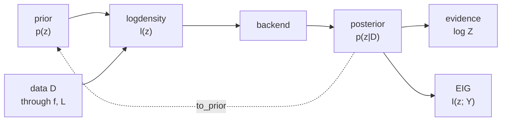

# Glossary

photomancy borrows several words from JAX and Equinox and gives a few of its own a specific
meaning. This page collects the vocabulary that runs through the rest of the documentation,
so that terms like leaf, scene, and partition are unambiguous when they appear in the
[architecture overview](architecture), the [mathematical foundations](mathematical-foundations),
and the example notebooks. Each term carries the symbol used for it in the formulas, so the
notation here is the same notation as the [mathematical foundations](mathematical-foundations).

The map below places the central symbols on the path a fit actually takes, from a prior and
some data, through the logdensity and a backend, to a posterior and the quantities read off
it.



## The scene and its parts

```{glossary}
PyTree
   The structural backbone of everything photomancy fits. A
   [PyTree](https://docs.jax.dev/en/latest/pytrees.html) is JAX's name for a nested
   structure of containers, tuples, lists, dictionaries, and Equinox modules, with arrays at
   the tips. JAX transformations walk this structure automatically, so a whole model can be
   passed around, differentiated, and mapped over a batch with `jax.vmap`, all as a single
   object.

Leaf
   One of those tips, an [array or scalar](https://docs.jax.dev/en/latest/pytrees.html) that
   JAX treats as data rather than structure. The fitted leaves, flattened and concatenated
   together, form the parameter vector $z$, while the surrounding structure stays fixed.

Scene
   $S$. The model being fit, expressed as a {term}`PyTree`, almost always an
   [`eqx.Module`](https://docs.kidger.site/equinox/api/module/module/). Its array leaves are
   the physical parameters, an orbit's elements, a disk's geometry, an atmosphere's
   abundances, and the engine never needs to know which is which. Swapping the scene and its
   {term}`forward model` is the whole of moving from one domain to another.

Partition
   The split that turns a scene into a fit. A partition is a boolean {term}`PyTree` with the
   same shape as the scene, its `filter_spec`, marking each {term}`leaf` to fit or to hold
   fixed. [Equinox filtering](https://docs.kidger.site/equinox/all-of-equinox/) then
   separates the scene into the fitted vector $z$ and a static remainder $S_0$, recombined
   for scoring as $S = \mathrm{combine}(z, S_0)$. Opening one more leaf in the partition is
   the difference between a circular and a Keplerian orbit fit in the
   [orbit example](../examples/orbit_fitting).

Static and dynamic
   [Equinox sorts](https://docs.kidger.site/equinox/all-of-equinox/) a module's fields into
   dynamic leaves, the JAX arrays that inference can touch and that make up $z$, and static
   fields, the Python values like names and option flags that define structure and trigger
   recompilation when they change. Only dynamic leaves can be fit.

z-space
   $z$. The flat vector the samplers actually see.
   {py:obj}`~photomancy.core.model.build_scene_logdensity` ravels the fitted leaves, that
   is, it flattens and concatenates them into a single one-dimensional array $z$, and
   returns an `unravel` function that reshapes a $z$ back into the scene. Posterior samples
   come out in this flat space, and `unravel` recovers the named parameters.
```

## Building a fit

```{glossary}
Forward model
   $f$. A pure function from a {term}`scene` to predicted data, $f(S)$, the map from
   parameters to what the instrument would measure. It carries all the physics, and the
   engine treats it as a black box.

Likelihood
   $L$. A function from predicted data to a scalar log-likelihood,
   $\log p(D \mid z) = \log L\big(f(S)\big)$, scoring how well a prediction matches the
   observation $D$ under the noise model. Forward model and likelihood are kept separate so
   the same physics can be reused with different noise assumptions.

Prior
   $p(z)$. What is known about the parameters before the data. photomancy ships its own
   small prior layer of {py:obj}`~photomancy.priors.AbstractPrior` objects over the fitted
   leaves, and any
   {term}`posterior` can become the next prior through `to_prior`, which is how beliefs carry
   forward across observations.

logdensity
   $\ell(z) = \log p(D \mid z) + \log p(z)$. The unnormalized log-posterior the samplers
   explore, the sum of the {term}`prior` and {term}`likelihood` terms.
   {py:obj}`~photomancy.core.model.build_scene_logdensity` assembles it from the forward
   model, the likelihood, and the prior and returns it as a
   {py:obj}`~photomancy.core.model.SceneLogDensity` module, so the arrays it depends on
   remain live inputs that JAX differentiates through, rather than constants frozen into the
   function.

Domain
   A packaged set of plug-ins, a {term}`forward model`, a {term}`likelihood`, and sensible
   priors, for one kind of problem. The orbit, disk, and atmosphere domains, built on
   [orbix](https://github.com/CoreySpohn/orbix) geometry and
   [skyscapes](https://github.com/CoreySpohn/skyscapes) scenes, let a typical fit call one
   helper rather than wiring the three pieces by hand.
```

## Running a fit

```{glossary}
Backend
   An inference algorithm with a uniform interface: give it a {term}`logdensity` and a
   starting point, and it returns a {term}`posterior`. The menu runs from the fast
   {term}`Laplace approximation` through the [BlackJAX](https://blackjax-devs.github.io/blackjax/)
   No-U-Turn and sequential Monte Carlo samplers to nested sampling via
   [jaxns](https://jaxns.readthedocs.io/en/latest/) and
   [NumPyro](https://num.pyro.ai/en/stable/contrib.html), so the same fit can be run cheaply
   for a first look or rigorously when the evidence matters.

Posterior
   $p(z \mid D)$. The belief after fitting, the distribution over the parameters given the
   data. Whatever backend produced it, it exposes the same handful of methods, `sample`,
   `log_prob`, `evidence`, and `to_prior`, so downstream code does not depend on how it was
   computed.

MAP
   $z_\star = \arg\max_z \ell(z)$. The maximum a posteriori point, the location of highest
   posterior density, the peak the optimizing backends climb to before measuring the
   curvature around it.

Laplace approximation
   $\mathcal{N}(z_\star, \Sigma)$ with $\Sigma = H^{-1}$. A Gaussian fit to a {term}`mode`,
   taking the {term}`MAP` as the mean and the inverse Hessian $H = -\nabla^2 \ell(z_\star)$
   as the covariance. It is the cheapest useful posterior, and it also yields an estimate of
   the {term}`evidence`.

Mode
   $\mathcal{N}(z_k, \Sigma_k)$. One peak of the posterior, one self-consistent explanation
   of the data. Multimodal problems, a blindly fit orbit period or a mirror-image source
   position, have several, and a single Gaussian can only sit on one of them.

Mixture
   $\sum_k w_k \mathcal{N}(z_k, \Sigma_k)$. The
   {py:obj}`~photomancy.posterior.MixturePosterior`, which holds several modes
   at once, each weighted by its evidence, $w_k \propto e^{\log Z_k}$. It is what lets
   photomancy represent ambiguity honestly instead of collapsing prematurely onto one
   answer, and it reports `n_modes` and a `best_mode`.
```

## Comparing and deciding

```{glossary}
Evidence
   $\log Z$. The log marginal likelihood, the probability of the data under a model with its
   parameters integrated out. It rewards fit and penalizes unnecessary flexibility, the
   built-in Occam factor, and every {term}`posterior` carries it as `evidence`.

Bayes factor
   $\log Z_1 - \log Z_0$. The difference of the log evidences of two competing models. It is
   the quantity that decides questions of model comparison, whether an orbit needs
   eccentricity, or whether an oxygen band is really present.

Expected information gain
   $\mathrm{EIG}(Y) = I(z; Y)$. How much a {term}`candidate` observation $Y$ is expected to
   sharpen the belief, the mutual information between the parameters and the observation,
   equivalently the expected reduction in posterior entropy before the data is in hand. It
   is the score photomancy uses to choose where to look next, and the same primitive serves
   every scale, from one exposure to a whole mission.

Candidate
   $Y$. A possible next observation, an epoch, a sensor placement, a wavelength, that the
   {term}`expected information gain` ranks. {py:obj}`~photomancy.eig.evaluate_candidates`
   takes a posterior and a
   forward model for the candidates and returns their scores.

Sequential updating
   $B_{k+1}(z) \propto p(D_{k+1} \mid z)\, B_k(z)$. Folding a new observation into the
   running belief by making the current {term}`posterior` the next {term}`prior`, through
   `to_prior`, and fitting again. Repeated, it is how a belief tightens observation by
   observation, and it closes the loop with the {term}`expected information gain` that chose
   each observation.
```

## Upstream documentation

The libraries photomancy builds on, for the terms borrowed from them:

- [JAX](https://docs.jax.dev/en/latest/pytrees.html) -- pytrees and leaves, and the
  transformations the engine runs on them.
- [Equinox](https://docs.kidger.site/equinox/all-of-equinox/) -- modules, and the filtering
  that partitions a scene into fitted and static parts.
- [BlackJAX](https://blackjax-devs.github.io/blackjax/) -- the No-U-Turn and sequential
  Monte Carlo samplers behind those backends.
- [jaxns](https://jaxns.readthedocs.io/en/latest/) -- nested sampling and the evidence it
  integrates.
- [NumPyro](https://num.pyro.ai/) -- probabilistic programming, and the nested-sampling
  wrapper the orbit backend uses.
- [orbix](https://github.com/CoreySpohn/orbix) -- the orbital geometry behind the orbit
  domain.
- [skyscapes](https://github.com/CoreySpohn/skyscapes) -- the scene and reflected-light
  models behind the disk and atmosphere domains.
